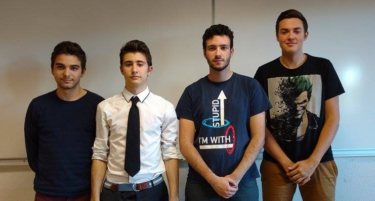

include::_settings_reveal.adoc[]

// include::_settings_deck.adoc[]

= MPA Project 2015

== MPA Project 2015

BERTIN Mathieu - HELLER Tanguy 

BOUVERON Maxime - BOURGUET Guillaume

== Summary
[%step]
* Functional assessment
* Financial assessment
* Technicial assessment
* Human assessment
* Global assessment

== Functional assessment

    screenshots, comment ça fonctionne ?
    Présenter l'application
    
== Financial assessment

    Estimation du nombre d'heures passées
    Estimation du salaire de chaque personne
    Total
    
== Technical assessment

Tools we used :

* SVN
* GitHub
* Java / Eclipse
	** Swing
	** MVC
* AsciiDoc
* Redmine
* MS-DOS Command Files (.bat)
    
== Human assessment
    
    Ce que ça nous a apporté côté humain
    Mieux travailler en équipe, sous contrainte ...
    
== Global assessment

    To sum up, this project 
    
    
